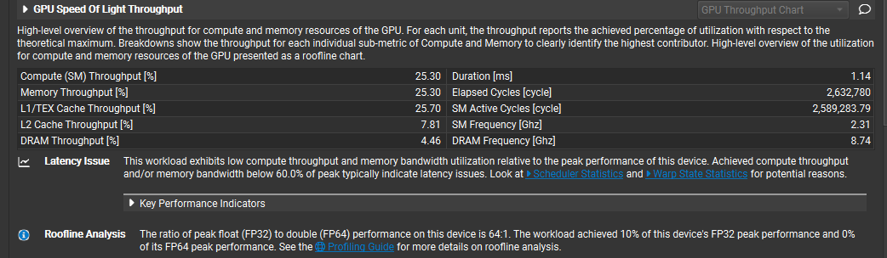
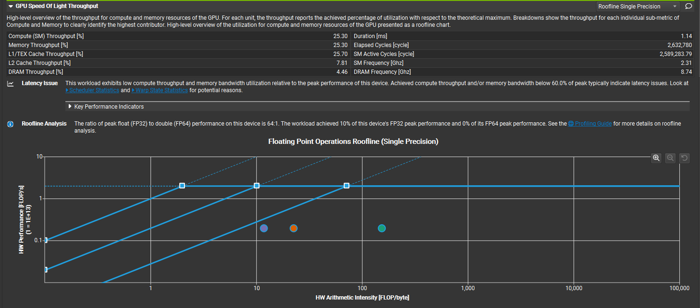
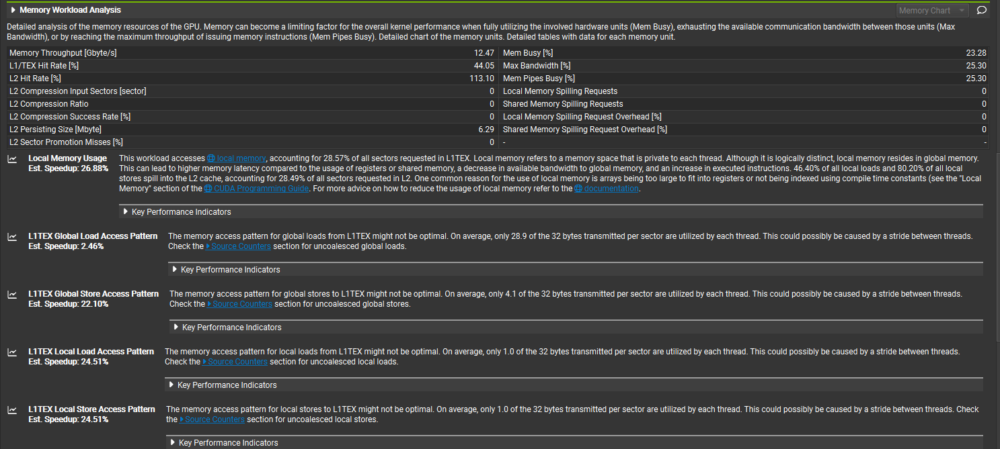
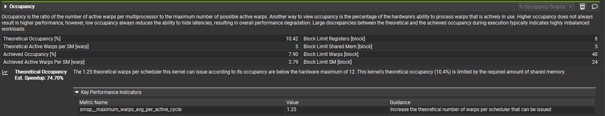

# flashattn-cuda-metal

FlashAttention forward kernel implemented from scratch in CUDA, with Apple Metal port planned.

Built on RTX 4060 Ti (Ada Lovelace, sm_89). No external FlashAttention libraries — pure CUDA C++ with PyTorch C++ extension binding.

## What This Is

A ground-up implementation of the FlashAttention algorithm (Dao et al., NeurIPS 2022) at the GPU kernel level. The kernel uses **tiling** and **online softmax** to reduce attention memory from O(N²) to O(N), without ever materializing the full N×N attention matrix.

This is not a wrapper or API call — it's the actual CUDA kernel that computes scaled dot-product attention using shared memory tiling and running statistics.

## Algorithm

The forward kernel implements Algorithm 1 from the FlashAttention paper:

1. **Tile Q into row blocks (B_r=32), K/V into column blocks (B_c=32)**
2. **Load Q row into registers** (stays fixed across all K/V blocks)
3. **For each K/V block:**
   - Collaboratively load K, V tiles into shared memory (16KB total)
   - Compute `S = Q · K^T × scale`
   - Online softmax update: `m_new = max(m_old, block_max)`, rescale previous accumulator by `exp(m_old - m_new)`, accumulate new block
4. **Normalize:** `O = acc / l_i`
5. **Store logsumexp** `L = m + log(l)` for backward pass

Thread model: one thread per Q row, grid = `(ceil(N/B_r), B×H)`, block = `(B_r,)`.

## Benchmark Results

**GPU:** NVIDIA GeForce RTX 4060 Ti | **Precision:** FP32 | **Config:** B=1, H=8, D=64

| Seq Len | Naive (ms) | Flash (ms) | Speedup | Naive Mem | Flash Mem | Mem Save |
|---------|-----------|-----------|---------|-----------|-----------|----------|
| 128     | 0.62      | 0.12      | 5.26×   | 10.6 MB   | 9.1 MB    | 1.16×    |
| 256     | 0.18      | 0.12      | 1.56×   | 16.1 MB   | 10.1 MB   | 1.59×    |
| 512     | 0.19      | 0.25      | 0.75×   | 36.2 MB   | 12.1 MB   | 2.98×    |
| 1024    | 1.59      | 0.94      | 1.69×   | 112.2 MB  | 16.2 MB   | 6.94×    |
| 2048    | 6.94      | 3.06      | 2.27×   | 408.2 MB  | 24.2 MB   | 16.88×   |
| 4096    | 27.87     | 11.18     | 2.49×   | 1576.4 MB | 40.2 MB   | **39.16×** |

Key takeaway: **39× memory savings at N=4096**. Naive attention uses 1.5GB while flash uses 40MB — this is the core value of FlashAttention's O(N) memory.

## Correctness

9/9 test configurations passed against naive attention reference, with max numerical difference < 1e-6:

```
[PASS] B=1, H=1, N=   32, D=64  |  max_diff=4.768372e-07
[PASS] B=1, H=1, N=   64, D=64  |  max_diff=3.874302e-07
[PASS] B=1, H=1, N=  128, D=64  |  max_diff=4.768372e-07
[PASS] B=1, H=1, N=   63, D=64  |  max_diff=4.768372e-07
[PASS] B=1, H=1, N=  127, D=64  |  max_diff=4.470348e-07
[PASS] B=2, H=4, N=  256, D=64  |  max_diff=4.768372e-07
[PASS] B=2, H=8, N=  512, D=64  |  max_diff=6.854534e-07
[PASS] B=1, H=1, N= 1024, D=64  |  max_diff=3.576279e-07
[PASS] B=1, H=1, N= 2048, D=64  |  max_diff=4.023214e-07
```

Tests cover single-block, multi-block, non-aligned sequence lengths, and multi-batch/multi-head configurations.

## Profiling (Nsight Compute)

Profiled with `ncu --set full` on N=1024, B=1, H=8, D=64.

### GPU Speed of Light



- Compute (SM) Throughput: 25.30%
- Memory Throughput: 25.30%
- L1/TEX Cache Throughput: 25.70%
- DRAM Throughput: 4.46%
- **Diagnosis: Latency-bound** — both compute and memory under 60%, indicating stalls

### Roofline (Single Precision)



Kernel operates in the compute-bound region (arithmetic intensity ~10-100 FLOP/byte) but achieves only 10% of FP32 peak. The gap between kernel points and the roofline ceiling represents optimization headroom.

### Memory Workload



- Local memory usage: 28.57% of L1TEX sectors — register spill detected
- Global store: 4.1/32 bytes utilized per sector — poor coalescing
- Local load/store: 1.0/32 bytes — worst-case access pattern from spilled registers

### Occupancy



- Theoretical occupancy: 10.42%
- Achieved occupancy: 7.90%
- Active warps per SM: 3.79
- **Bottleneck: shared memory** (Block Limit Shared Mem = 5)
- Estimated speedup from fixing: 74.70%

### Profiling Summary

1. Kernel is compute-bound but SM utilization is only 10% — compute units are mostly idle
2. Root cause: occupancy 7.9% + register spill → insufficient warps to hide latency
3. Optimization targets: tile size tuning + FP16 Tensor Core utilization

## Project Structure

```
flashattn-cuda-metal/
├── cuda/
│   └── flash_attn_kernel.cu    # FlashAttention forward CUDA kernel
├── ref/
│   └── naive_attn.py           # O(N²) reference implementation
├── tests/
│   └── test_forward.py         # Correctness tests (9 configs)
├── bench/
│   └── bench_forward.py        # Speed/memory benchmark with CSV output
├── docs/
│   └── profiling/              # NCU screenshots
├── setup.py                    # PyTorch CUDA extension build
├── LICENSE                     # MIT
└── README.md
```

## Build & Run

Requires: CUDA toolkit matching your PyTorch CUDA version, PyTorch with CUDA support.

```bash
# Build
pip install -e .

# Test correctness
python tests/test_forward.py

# Benchmark (outputs CSV to bench/results/)
python bench/bench_forward.py

# Profile with Nsight Compute
ncu --set full --launch-count 1 --kernel-name flash_attn_fwd_kernel \
    --export bench/results/flash_fwd \
    python -c "
import torch, flash_attn_cuda
Q=torch.randn(1,8,1024,64,device='cuda')
K=torch.randn(1,8,1024,64,device='cuda')
V=torch.randn(1,8,1024,64,device='cuda')
flash_attn_cuda.forward(Q,K,V)
"
```

## Current Specs

- Precision: FP32
- Head dimension: D=64 (compile-time constant)
- Tile sizes: B_r=32, B_c=32
- Shared memory: 16KB (sK[32][64] + sV[32][64])
- Target GPU: RTX 4060 Ti (sm_89, Ada Lovelace)

## Roadmap

- [ ] Backward kernel (dQ, dK, dV computation)
- [ ] FP16 support with Tensor Core (WMMA/MMA)
- [ ] Occupancy optimization (tile size tuning, register pressure reduction)
- [ ] Warp-level primitives (`__shfl_sync` for reductions)
- [ ] Apple Metal port (M4 Pro)
- [ ] Causal masking support

## Environment

- GPU: NVIDIA GeForce RTX 4060 Ti
- OS: Windows 11 + WSL2 (Ubuntu 24.04)
- CUDA: 12.8
- PyTorch: 2.x (CUDA 12.8 build)
- Profiler: Nsight Compute, Nsight Systems

## References

- Dao et al., "FlashAttention: Fast and Memory-Efficient Exact Attention with IO-Awareness" (NeurIPS 2022)
- Dao, "FlashAttention-2: Faster Attention with Better Parallelism and Work Partitioning" (2023)
- NVIDIA CUDA C++ Programming Guide
- MIT 6.5940 TinyML (Song Han)

## License

MIT
