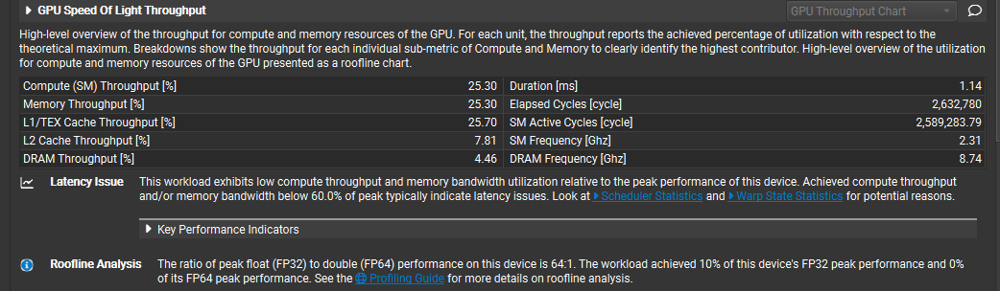
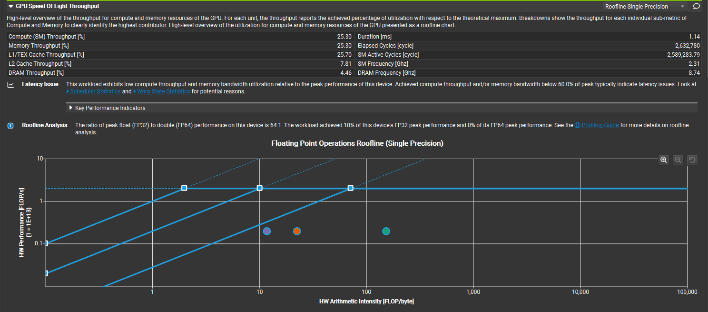
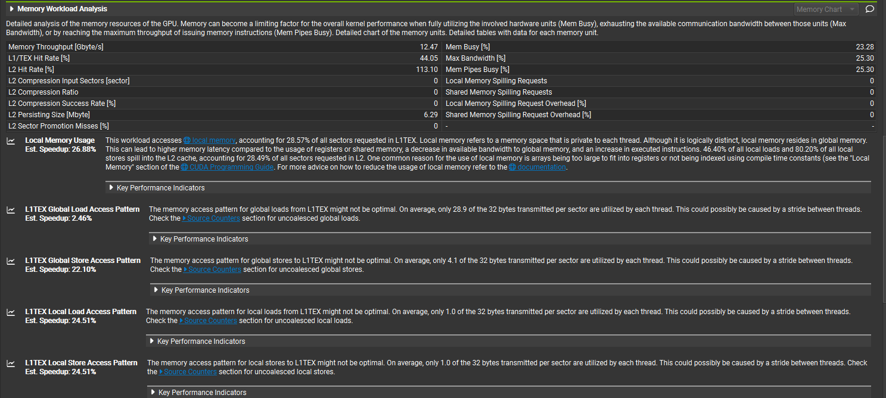
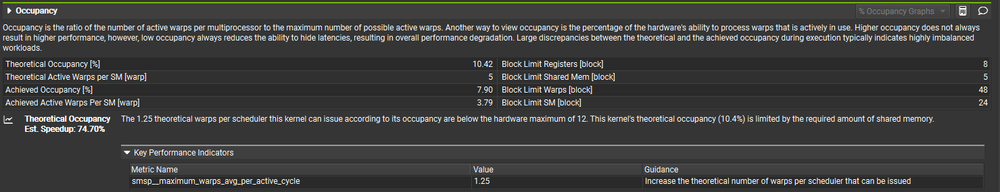

# flashattn-cuda

FlashAttention forward kernels written from scratch in CUDA.
The current forward kernel uses `mma.sync` and online softmax on an RTX 4060 Ti.

Forward kernel used in the benchmark below:

```text
cuda/flash_attn_mma_db_full.cu
```

Forward latency compared with [PyTorch SDPA](https://docs.pytorch.org/docs/stable/generated/torch.nn.functional.scaled_dot_product_attention.html), using its `FLASH_ATTENTION` backend:

| N | db_full, +L | PyTorch SDPA-Flash | gap |
|---:|---:|---:|---:|
| 1024 | 0.0620 ms | 0.0584 ms | +5.3% |
| 2048 | 0.2221 ms | 0.2182 ms | +1.3% |
| 4096 | 0.8726 ms | 0.8480 ms | +1.6% |

Tested on RTX 4060 Ti, CUDA 12.8, PyTorch 2.10.0+cu128, B=1, H=8, D=64,
FP16 input, FP32 accumulate, non-causal forward. The numbers above are 10-run
paired medians from `bench/bench_mma_headline.py`.
The script calls `torch.nn.functional.scaled_dot_product_attention` inside
`sdpa_kernel(SDPBackend.FLASH_ATTENTION)`.

<p align="center">
  
</p>

## Implementation History

| Stage | What changed |
|---|---|
| FP32 baseline | plain tiled FlashAttention forward |
| WMMA path | first Tensor Core attempt |
| mma | direct `mma.sync`, register softmax, no shared S/P round trip |
| mma-db | K/V `cp.async` double buffer |
| db_addr | removed repeated integer address calculations |
| db_full | full-tile fast path for common benchmark sizes |

At `N=4096`, forward latency decreased from about 3.2 ms to about 0.873 ms.

<p align="center">
  
</p>

## Nsight Compute Snapshot

Nsight Compute profiles of `mma` and `db_full` at `N=4096`, using one launch
per kernel. The latency benchmark above uses CUDA events and paired runs.

| Metric | mma before | db_full after |
|---|---:|---:|
| Duration | 1.38 ms | 0.987 ms |
| Compute throughput | 35.18% | 43.32% |
| Memory throughput | 35.18% | 41.84% |
| Achieved occupancy | 43.22% | 38.01% |

The full Nsight Compute reports, text exports, and original uncropped UI
captures are kept under `docs/profiling/ncu/` and `docs/profiling/ncu_sections/`.
Archived reports and screenshots retain their original kernel names.

The following FP32 and `db_full` profiles use different shapes and dtypes.
Their durations are not directly comparable.

| Metric | old FP32 kernel screenshot | current db_full report |
|---|---:|---:|
| Shape | N=1024, FP32 | N=4096, FP16 input / FP32 accumulate |
| Duration | 1.14 ms | 0.989 ms |
| Compute throughput | 25.30% | 43.33% |
| Memory throughput | 25.30% | 41.78% |
| L1/TEX throughput | 25.70% | 34.76% |
| L2 throughput | 7.81% | 42.31% |
| DRAM throughput | 4.46% | 4.56% |
| Theoretical occupancy | 10.42% | 41.67% |
| Achieved occupancy | 7.90% | 38.06% |
| Active warps per SM | 3.79 | 18.27 |
| Local spill signal | visible in Memory Workload | 0 local memory spilling requests |

Nsight Compute screenshots:

| Section | Before | After |
|---|---|---|
| GPU Speed of Light |  |  |
| Roofline |  |  |
| Memory Workload |  |  |
| Occupancy |  |  |

## Current Kernel

The final forward kernel uses:

| Part | Choice |
|---|---|
| QK | `mma.sync.m16n8k16` |
| PV | `mma.sync.m16n8k16` |
| Softmax | online softmax in registers |
| K/V load | two-stage `cp.async` |
| Shared memory | K/V tiles only |
| Fast path | predicate-free when N is a full tile |
| Output | `O` half, `L` float |

The benchmark uses `forward()` with `L` enabled, since PyTorch's Flash backend
also computes softmax logsumexp internally. The O-only path is excluded from
that comparison.

## Optimization Experiments

The table includes `db_full(+L)` and experimental variants. Only `db_full(+L)`
is used in the SDPA comparison above.

| Attempt | Result | Status |
|---|---|---|
| FP32 tiled baseline | FP32 reference implementation | kept as baseline |
| WMMA path | initial Tensor Core implementation | superseded |
| mma | direct `mma.sync`, register softmax, no shared S/P round trip | kept in chain |
| mma-db | added two-stage K/V `cp.async` | kept in chain |
| db_addr | removed repeated shared/global address calculations and reduced SASS integer instructions | kept in chain |
| db_full | removed full-tile predicates for N divisible by the tile size | benchmark kernel |
| fp16-acc QK | about 21-24% faster with FP16 QK accumulation, but loses accuracy on larger logits | ablation only |
| BC=64 tile | correct, but shared memory footprint cut residency too much | rejected |
| softmax/PV source interleave | correct and nearly bit-identical, but slower in paired runs | rejected |
| cross-iteration precompute | correct, but the extra live state hurt scheduling more than it helped | rejected |
| launch bounds, max register count, PAD changes, static N only | no stable win in paired runs | rejected |

Earlier FP32 and WMMA experiments:

| # | Attempt | Result | Observation |
|---:|---|---|---|
| 1 | tile size 32 -> 16 plus `launch_bounds` | 11.18 ms -> 15.44 ms | K/V loop count doubled while register pressure stayed high |
| 2 | FP16 shared memory | 11.18 ms -> 16.28 ms | occupancy improved, but `half2float` conversion became the cost |
| 3 | WMMA 16x16 | 11.18 ms -> 11.83 ms | Tensor Cores were not enough with small tiles and scalar softmax between MMA phases |
| 4 | WMMA plus `half2` load | 11.63 ms at N=4096, 0.09 ms at N=128 | removed spill and helped small N, but still not enough for large N |
| 5 | multi-warp, 4 warps per block | rolled back | about 35 KB shared memory per block cut residency too hard |
| 6 | `sQ/sK/sV` +8 padding | 10.41 ms at N=4096 | shared load bank conflict dropped from 4.6-way to 2.7-way |
| 7 | `sO` +1 padding | slower | conflict barely moved, so residual conflict was not from the output accumulator |
| 8 | `sP` +8 padding | 10.41 ms -> 10.55 ms | store conflict improved, but runtime regressed from shared-memory pressure |

## Files

| File | Notes |
|---|---|
| `cuda/flash_attn_kernel.cu` | FP32 baseline |
| `cuda/flash_attn_wmma.cu` | older WMMA path |
| `cuda/mma_probe.cu` | checks `mma.sync` and `ldmatrix` layouts on the GPU |
| `cuda/flash_attn_mma.cu` | direct `mma.sync` version |
| `cuda/flash_attn_mma_db.cu` | adds `cp.async` double buffering |
| `cuda/flash_attn_mma_db_addr.cu` | cuts address generation overhead |
| `cuda/flash_attn_mma_db_full.cu` | benchmark kernel |
| `cuda/flash_attn_mma_bc64.cu` | negative ablation |
| `cuda/flash_attn_mma_db_full_intl.cu` | negative ablation |
| `cuda/flash_attn_mma_fp16acc.cu` | FP16 QK accumulation experiment |
| `bench/bench_mma_headline.py` | db_full(+L) vs SDPA comparison |

## Correctness

The mma line is checked against a half-cast PyTorch reference.

| Check | Result |
|---|---|
| `tests/test_mma_probe.py` | 3/3 layout probes pass |
| `tests/test_mma_db_full.py` | 19/19 correctness configs pass |
| non-aligned N | included |
| direct FP16 input | included |
| amplified-value stress cases | included |
| typical final-kernel error | `O` around `5.3e-4`, `L` around `1.9e-6` |

The FP32 forward tests are also included.

## Build And Run

The repo was developed on WSL2 Ubuntu with CUDA 12.8.

```bash
CUDA_HOME=/usr/local/cuda-12.8 pip install -e . --break-system-packages
```

Main checks:

```bash
python3 tests/test_mma_probe.py
python3 tests/test_mma_db_full.py
python3 bench/bench_mma_headline.py
```

For the older FP32 kernel, `python3 bench/bench_forward.py` compares against
PyTorch SDPA's `MATH` backend. This is separate from the FP16 Flash-backend
comparison above. No results from the new math-backend comparison are recorded yet.

Other useful scripts:

```bash
python3 bench/bench_mma_final.py
python3 bench/bench_mma_variants.py
python3 bench/profile_mma_once.py
```

Rebuild the extension before checking register counts to avoid inspecting a
stale `.so`.

## Limits

| Covered | Not covered yet |
|---|---|
| non-causal | causal mask |
| D=64 | D=128 |
| fixed dense Q/K/V | varlen, dropout, GQA, MQA |
| RTX 4060 Ti | cross-GPU generality |
